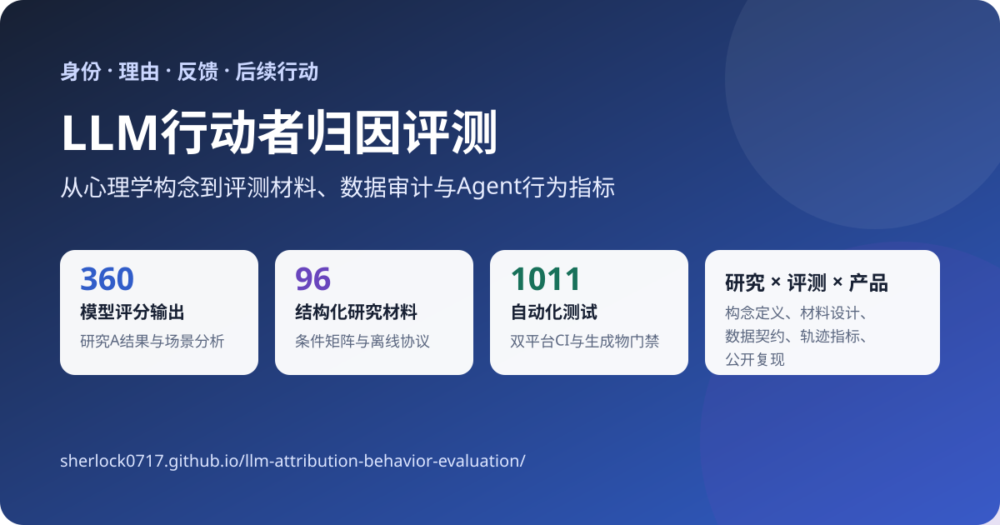
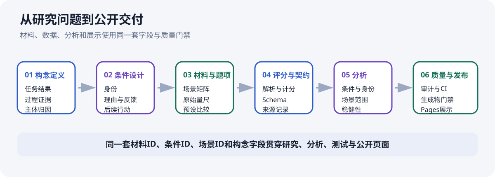
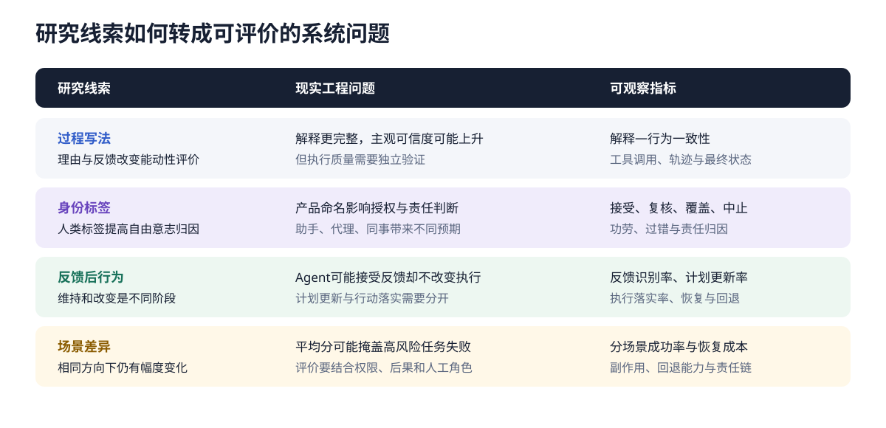

<p align="center">
  
</p>

# LLM行动者归因评测

一套把心理学构念转化为LLM材料设计、评价维度、数据审计和Agent行为指标的研究工程项目。

- [项目总览](https://sherlock0717.github.io/llm-attribution-behavior-evaluation/)
- [研究A：身份与决策过程](https://sherlock0717.github.io/llm-attribution-behavior-evaluation/identity-process-attribution-baseline/)
- [研究B：机器主体决策过程](https://sherlock0717.github.io/llm-attribution-behavior-evaluation/machine-decision-process-attribution/)
- [项目案例摘要](docs/PORTFOLIO_CASE_STUDY.md)

## 项目一览

| 研究与工程资产 | 规模 |
|---|---:|
| DeepSeek模型问卷评分输出 | 360次 |
| 结构化研究材料 | 96条 |
| 任务场景 | 8个 |
| 过程条件 | 6种 |
| 自动化测试 | 1005项 |
| CI环境 | Ubuntu与Windows |

## 研究问题

当语言模型读到一个人或AI作出决定时，它会怎样判断这个行动者是否自主、有意图、能影响结果，或者应当承担责任？本项目把这种判断称为**行动者归因**。

项目把三个对象分开记录：

1. **任务结果**：目标是否完成、约束是否满足；
2. **可观察过程**：是否比较备选、说明理由、处理反馈并改变后续行动；
3. **主体归因**：评价者据此形成的能动性、自由意志、心理状态和责任判断。

## 项目工作覆盖

### 研究设计

- 从心理学构念出发定义评价对象；
- 将身份、备选、理由、反馈和后续行动转化为可控制条件；
- 映射原始题项、量尺和预设比较；
- 按场景、身份和过程条件组织分析单位。

### 数据与评测

- 建立模型响应解析、题项计分和聚合流程；
- 为研究B构建96条材料、四个主要评价维度和六项预设比较；
- 区分历史真实响应、固定分析示例和未来外部评分记录；
- 通过数据契约保持材料、评分、分析和页面字段一致。

### 工程与质量门禁

- 材料结构审计、严格JSON检查和生成物漂移检查；
- Ubuntu与Windows双平台CI；
- mock smoke验证完整执行链路，同时避免误调用真实API；
- GitHub Pages统一组装总览页、研究A和研究B。

### 产品与Agent迁移

- 将“收到反馈—更新计划—改变执行”拆成可观察阶段；
- 将解释文本与工具调用、执行轨迹和最终状态交叉检查；
- 将身份名称、解释方式和自动化范围连接到信任、覆盖和责任判断；
- 按任务风险、人机角色和回退权限组织场景化评价。

## 两项研究

### 研究A：身份与决策过程归因

研究A交叉六种决策过程写法与AI／人类身份标签，分析360次DeepSeek模型问卷评分输出。六种过程条件与两种身份形成12个实验组合，每个组合包含30次评分；这些记录分布到8个任务场景中，并进一步汇总为96个场景×身份×过程条件单元。

### 研究B：机器主体决策过程归因

研究B固定机器主体，把过程信息拆成只给出决定、展示备选、给出理由、加入反馈、反馈后维持和反馈后改变六种条件，共形成96条材料、四个主要评价维度、六项预设比较以及离线分析协议。

## 主要发现

1. **高结构过程写法对应更高的能动性评分。** 在1—7分量尺上，包含理由、反思、反馈与后续行动的成套写法，比只包含较长背景和最终选择的写法平均高1.263分；16个场景×身份配对单元方向一致。
2. **人类标签对应更高的自由意志归因。** 在1—7分量尺上，任务场景和过程写法相同时，人类标签下的自由意志归因平均比AI标签高0.760分；48个场景×过程条件身份配对单元方向一致。
3. **变化幅度随任务场景而变。** 过程差异在八个场景中的平均范围为0.67至1.92，留一场景分析中保持同号。

这里的360表示模型评分输出次数；16和48表示材料组合的配对数量。文本长度与过程条件共同变化，因此过程结果按两种完整写法的差异理解。

## 从研究问题到公开交付

<p align="center">
  
</p>

这条链路将研究设计与工程交付放在同一套数据结构中：材料和题项决定测量对象，解析和计分形成结构化记录，分析脚本生成公开数据，审计与CI阻止字段漂移、非法JSON和历史输出污染，Pages组装则把同一批资产转成可检查的公开页面。

## 从研究发现到实际问题

<p align="center">
  
</p>

| 研究线索 | 现实工程问题 | 可观察指标 |
|---|---|---|
| 过程写法改变能动性评价 | 更完整的解释可能提高主观可信度，但未必对应更好的执行 | 解释—行为一致性、工具调用正确率、最终状态 |
| 身份标签改变自由意志归因 | “助手”“代理”“同事”等命名可能影响授权和责任判断 | 接受率、复核率、覆盖率、中止率、责任归因 |
| 反馈、维持和改变可以拆分 | Agent可能口头接受反馈，却没有更新计划或执行 | 反馈识别率、计划更新率、执行落实率 |
| 场景中的变化幅度不同 | 总体平均分可能掩盖高风险任务中的失败 | 分场景成功率、恢复成本、副作用、回退能力 |
| 材料结构与语义问题需要分开 | 数据完整不等于构念实现准确 | 结构错误率、重复率、语义复核状态 |

## 关键工程决策

- **保留原量尺。** 不把不同来源和量尺的构念强行合并成单一总分。
- **预设比较。** 研究B用P1—P6明确每次比较增加了哪些信息，避免只看六组均值后再解释。
- **区分数据角色。** 历史真实响应、固定流程示例和未来外部评分使用不同目录与状态字段。
- **保护历史输出。** 测试和CI不能覆盖研究A已有数据，公开生成物必须与当前脚本一致。
- **默认离线安全。** CLI拒绝真实API执行，mock smoke只验证工程链路。
- **把材料审计放在评分之前。** 先检查网格、字段、重复和长度阈值，再讨论评价结果。

## 技术栈与质量门禁

`Python 3.12` · `pandas` · `statsmodels` · `Pydantic` · `pytest` · `Ruff` · `uv` · `GitHub Actions` · `GitHub Pages`

CI覆盖：

- 研究A稳健性生成物跨平台等价检查；
- 研究B协议包与材料结构审计；
- 严格JSON验证；
- 全量测试与mock smoke；
- 仓库状态和历史输出保护；
- Pages组装后的漂移检查。

## 在线浏览与本地复现

只阅读项目时，直接使用上方三个在线入口。

本地预览需要Python 3.12与[uv](https://docs.astral.sh/uv/)：

```bash
uv sync --frozen
python scripts/assemble_pages.py --output _site
python -m http.server 8000 --directory _site
```

上述命令只组装本地页面，不调用真实模型。完整开发验证：

```bash
uv run python scripts/build_site_data.py --check
uv run python scripts/build_showcase_data.py --check
uv run python scripts/build_study_b_protocol_package.py --check
uv run python scripts/check_research_a_robustness_outputs.py
uv run python scripts/audit_study_b_materials.py --check
uv run python scripts/check_public_json.py
uv run pytest -q
```

## 文档入口

- [项目案例摘要](docs/PORTFOLIO_CASE_STUDY.md)
- [结果与延伸问题](docs/RESULTS_AND_PRACTICAL_IMPLICATIONS.md)
- [研究A说明](docs/STUDY_CARD.md)
- [研究B说明](docs/STUDY_B_CARD.md)
- [评测与产品检查清单](docs/EVALUATION_DESIGN_CHECKLIST.md)
- [总体研究计划](docs/RESEARCH_PROGRAM.md)
- [统一数据来源字典](docs/data_provenance.yaml)

## 权利与使用

仓库代码、材料、数据和文档由作者保留权利。引用时请注明“LLM行动者归因评测”与仓库地址；来源题项按照对应来源文档记录的许可状态使用。
